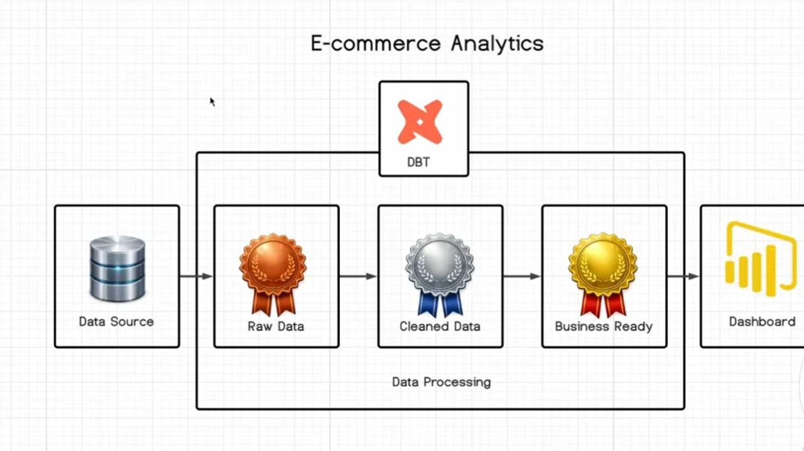

# E-commerce Analytics (dbt + Evidence Reporting)

End-to-end analytics engineering mini-project:

- **dbt** transforms raw e-commerce data into clean, business-ready models (Postgres)
- **Evidence (Reporting)** reads those models and serves a KPI dashboard

## Live Dashboard Preview
- https://ecommerce-analytics-iota.vercel.app/ecommerce

## Architecture / Data Transformation Pipeline



1. **Data Source** → raw dataset
2. **dbt** transforms raw → cleaned → business-ready models in Postgres
   - Example gold models: `dev_schema.fct_order`, `dev_schema.dim_customer`
3. **Reporting (Evidence)** queries those models and renders a KPI dashboard

---

## Prerequisites

- Python (3.9+ recommended)
- Node.js + npm
- Postgres running locally

### Recommended: install dbt in a virtual environment (uv)

If you want a reproducible local setup, use a dedicated virtual env and install dbt + the Postgres adapter inside it.

1) Install uv:

```bash
brew install uv
# or: pipx install uv
```

2) Create & activate a virtual environment:

```bash
uv venv
source .venv/bin/activate
```

3) Install dbt + Postgres adapter:

```bash
uv pip install -r requirements.txt
# (installs dbt-core and dbt-postgres)

dbt --version
```

### Alternative: pipx (works, but keep adapters consistent)

Using `pipx install dbt-core` is fine, but **the adapter must be installed into the same environment** as dbt.

Example:

```bash
pipx install dbt-core
pipx inject dbt-core dbt-postgres
```

If you prefer mixing approaches (e.g., dbt via pipx but adapters in a venv), you can run into "Could not find adapter" errors.

---

## Run the dbt project

```bash
cd ecommerce_dbt

# optional
# dbt deps

dbt run
dbt test
```

Tip: the dbt connection is configured in `~/.dbt/profiles.yml` under the `ecommerce_dbt` profile.

---

## Run the dashboard (Evidence)

```bash
cd Reporting
npm install

# pulls data from Postgres and generates Evidence query outputs
npm run sources

# start dev server
npm run dev
```

Open:
- Home: http://localhost:3000/ (redirects to the dashboard)
- Dashboard: http://localhost:3000/ecommerce

---

## Build a static portfolio version

```bash
cd Reporting
npm run sources
npm run build
```

Static output is generated in `Reporting/build/`.

---

## Notes

- Evidence stores sensitive DB values in `*.options.yaml` which is gitignored.
- If you change dbt model logic, rerun:
  - `dbt run`
  - `npm run sources`
